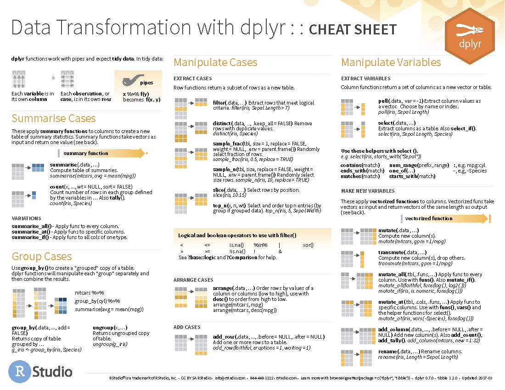

```{r parametres, include=FALSE, message=FALSE, warning=FALSE}
setwd("~/Downloads")
if(!"gutenbergr" %in% rownames(installed.packages())) {install.packages("gutenbergr")}
knitr::opts_chunk$set(echo = TRUE, warning = FALSE, message = FALSE)
extensions = c("ggplot2","rmdformats", "dplyr", "stringr", "gutenbergr")
lapply(extensions, require, character.only = TRUE)
```


## Objectifs de l'atelier

* Apprendre à manipuler des listes et des tableaux de données
* Se familiariser avec les expressions régulières
* Se familiariser avec l'extension `dplyr`

## Parties de l'atelier

* Manipulation de listes
* Manipulation des tableaux de données (`data frame`)
* Importation de documents depuis le Projet Gutenberg
* Manipulation des documents importés

## Les structures de données (suite du premier atelier)

### Le vecteur (rappel)
Le vecteur est une structure à une seule dimension qui peut contenir un nombre théoriquement illimité d'éléments. Sa seule contrainte est de ne pouvoir accepter que des éléments du même type. Un vecteur doit être composé exclusivement de caractères, ou de nombres, ou de booléens (TRUE/FALSE).

Question de révision:

- Que fera R si on essaye de concatéger un nombre entier et un nombre avec fractions? Un nombre avec fraction et une chaîne de caractères?
- Comment est-ce que je peux extraire le quatrième élément d'un vecteur?
- Comment est-ce que je peux remplacer un élément par un autre dans un vecteur?
- Comment puis-je attribuer des noms aux éléments d'un vecteur?

### Manipulation des listes
La liste ressemble au vecteur en ceci qu'il s'agit d'une structure de données unidimensionnelle, dont la longueur pourra être obtenue avec la fonction `length()`, mais, contrairement au vecteur, elle peut contenir tous types d'objets: des vecteurs de différents types, des fonctions, des listes, des tableaux de données, etc.

On a appris à manipuler les vecteur dans le premier atelier, mais on a laissé de côté celle des listes. Créons une courte liste comprenant cinq vecteurs ayant chacun quatre éléments.

```{r}
mes_oeuvres_l <- list(nom = c("Anne Hébert",
                              "Nicole Brossard",
                              "Joséphine Bacon",
                              "Martine Delvaux"),
                      oeuvre = c("Le tombeau des rois",
                                 "Le désert mauve",
                                 "Un thé dans la toundra",
                                 "Les filles en série"),
                      annee = c(1953L, 1993L, 2013L, 2016L),
                      genre = c("poésie", "roman", "poésie", "essai"),
                      prose = c(FALSE, TRUE, FALSE, TRUE))

mes_oeuvres_l
```
La liste acceptant des éléments de différentes classes et types, la création de la nôtre n'a pas entraîné la transformation de ses éléments

```{r}
str(mes_oeuvres_l)
```

#### Indexation des éléments d'une liste par nom
En créant notre liste, on a attribué à chaque élément un nom avec l'opérateur `=`. On peut maintenant utiliser l'opérateur `$` pour appeler le contenu de l'élément. L'élément de la liste ainsi appelé sera un vecteur, ce qu'on peut vérifier en passant l'élément extrait à la fonction `str()`.

```{r extraction-liste-nom}
mes_oeuvres_l$nom

str(mes_oeuvres_l$nom)

```

#### Indexation des éléments d'une liste par position
L'indexation d'une liste peut également se faire en utilisant la position de l'élément (double crochets).

```{r extraction-liste-position-booleen}
mes_oeuvres_l[[1]] # Extraction du premier élément de la liste

```

On se souvient que notre liste est composée de quatre vecteurs. C'est donc dire que si on voulait manipuler le premier élément du premier vecteur composant notre liste, on pourrait le faire en suivant la logique `nom_liste``[[position_1er_element_liste]]``[position_1er_element_vecteur]`

```{r}
mes_oeuvres_l[[1]][1]

```

Si je souhaitais ajouter un élément à l'actuelle liste, je le ferais par assignation ou avec la fonction `append()`:

```{r}
mes_oeuvres_l$naissance_auteur <- c(1916L, 1943L, 1947L, 1968L)
mes_oeuvres_l <- append(mes_oeuvres_l, list(deces_auteur=c(2000, NA, NA, NA)))

```

L'ajout d'une valeur à la fin de chacun des éléments d'une liste est un peu plus compliqué, car ces éléments sont indépendants les uns des autres. C'est un peu comme si la liste était un train dont chaque élément constituait un wagon indépendant l'un de l'autre. Dès lors, la seule manière d'ajouter un élément à chacun des éléments de la liste est d'itérer sur chacun.

La fonction `mapply()` permet de faire une telle opération. Elle provient d'une famille de fonctions aussi rapide que puissante. Le premier argument de cette fonction... une fonction. On ajoute ensuite les arguments de la fonction convoquée, séparés par une virgule, puis on précise si on souhaite obtenir à la sortie un résultat « simplifié » (un vecteur) ou non. Dans le cas présent, nous souhaitons conserver la structure de la liste et nous allons donc donner la valeur FALSE à cet argument. 

```{r}
nouvel_auteur <- c("Elizabeth Bégon", "Lettres au cher fils", 1748L, "lettre", TRUE, 1696L, 1755L)

mes_oeuvres_l <- mapply(append, mes_oeuvres_l, nouvel_auteur, SIMPLIFY = FALSE)

mes_oeuvres_l
```

## Le tableau de données
Le tableau de données, ou `data frame` en R, est sans doute la structure la plus utilisée dans l'analyse des données. Il permet d'assembler en une seule table une série de vecteurs. Chaque colonne est ainsi composée d'un et d'un seul type de données, mais deux colonnes ou plus peuvent être de différents types. Le tableau de données partage donc avec la liste la capacité d'assembler des données hétérogènes, mais contrairement à la liste, le tableau de données les assemble en utilisant une deuxième dimension (les lignes ou observations).

Le tableau de données peut être créé avec la fonction `data frame()`, auquel on fournit un nombre donné de vecteurs. On peut reprendre les noms d'écrivains, les titres d'oeuvres et les dates de publication utilisées ci-dessus, après avoir fait un brin de ménage dans notre environnement de travail.

```{r}
# La ligne de code ci-dessous permet de supprimer tous les éléments de l'environnement, à l'exception de celui indiqué dans la fonction `setdiff()`.
rm(list = setdiff(ls(), c("mes_oeuvres_l")))

# La façon rapide de transformer la liste en tableau de données est d'appliquer simplement la fonction `data.frame()` à l'objet `mes_oeuvres_l`. Chaque des éléments de la liste sera transformé en variable du tableau:
mes_oeuvres_df <- data.frame(mes_oeuvres_l)
mes_oeuvres_df

```


### L'indexation des valeurs du tableau de données

#### L'indexation par position
L'indexation des valeurs du tableau de données peut se faire, comme dans le cas du vecteur, avec des crochets apposés au nom de l'objet. À la différence du vecteur, cependant, deux valeurs sont attendues pour cette opération, l'une pour les lignes ou observations, l'autre pour les colonnes ou variables. Par convention, on utilise la lettre `i` pour désigner la première valeur, et `j` pour désigner la seconde, selon le modèle `nom_du_tableau[i, j]`.

```{r}
mes_oeuvres_df[1,2] # Indexation d'une valeur unique

mes_oeuvres_df[c(1:3),4] # Indexation de trois observations tirées de la variable en position 4

mes_oeuvres_df[median(nrow(mes_oeuvres_df)), 1] # Indexatio de la valeur de la première colonne de correspondant à l'observation en position médiane du tableau

mes_oeuvres_df[, ncol(mes_oeuvres_df)] # Extraction des valeurs de la dernière colonne du tableau
```

#### L'indexation par nom
Dans un tableau de données en R-base, chaque colonne et chaque ligne se voient attribuer un nom par défaut si cela n'a pas été fait manuellement.

```{r}
test <- data.frame(1:10, letters[1:10])
colnames(test)
rownames(test)

str(test)
```

On peut définir ces noms très aisément, par assignation.

```{r}
(rownames(test) <- sample(x = c(10:100), size = nrow(test), replace = FALSE))
# Arguments de la fonction `sample()`: x = valeur de l'échantillon; size = nombre d'individus; replace = si TRUE, reprise possible des mêmes individus.

(colnames(test) <- c("nos", "lettres"))

```

Il y a un grand avantage à avoir des noms de lignes. Ce sont des identifiants uniques qui seront par défaut exclus des calculs ou des opérations qui seront faites sur les valeurs des colonnes. Vous le verrez à l'usage.

L'indexation des observations et des variables peut se faire en utilisant les noms qui leur ont été donnés par défaut ou manuellement.

```{r indexation-tableu-nom}

mes_oeuvres_df["2",] # Indexation de la ligne "2"
mes_oeuvres_df[, "nom"] # Indexation de la colonne "nom"

mes_oeuvres_df["4", "annee"] # indexation de la valeur `i`, `j` au croisement de la ligne "4" et de la colonne "annee"

```

L'opérateur `$` peut être utilisé comme raccourci pour l'indexation d'une colonne. On sait que chaque colonne constitue un vecteur et on pourra donc utiliser le crochet simple pour indexer la valeur spécifique qui nous intéresse au croisement de `i` et de `j`.

```{r indexation-tableau-position}

mes_oeuvres_df$oeuvre[2]

mes_oeuvres_df$nom[1:3]

mes_oeuvres_df$naissance_auteur[c(1, 3:5)]

```

Et comme de fait, je peux me servir de ces différents modes d'indexation pour extraire ou remplacer une ou plusieurs valeurs

```{r indexation-tableau-operateur}

mes_oeuvres_df$oeuvre[1:2] <- c("Kamouraska", "L'écho bouge beau")
mes_oeuvres_df
```

Enfin, l'ajout d'une nouvelle colonne repose sur le même principe:

```{r ajout-colonne}
mes_oeuvres_df$initiales_auteur <- c("AH","NB", "JB", "MD", "EB")

mes_oeuvres_df <- mes_oeuvres_df[, c(1, 8, 2:7)] # Repositionnement de cette colonne dans le tableau
```


## Manipulation d'un tableau avec l'extension `dplyr`

On a rapidement introduit l'extension `stringr` dans le dernier atelier. Cette extension fournit une multitude de fonctions permettant de manipuler les chaînes de caractères, donc des valeurs spécifiques de vecteurs. 

Rappelons quelques-unes des fonctions de cette extension:

* str_detect()            ==> Repère la présence d'un motif dans une chaîne (renvoit TRUE/FALSE)
* str_sub()               ==> Extraie un segment donné d'une chaîne de caractères (arguments: début = 1L, fin = 1L)
* str_subset()            ==> Extraie seulement les vecteurs contenant un certain motif
Etc.

La famille `tidyverse` fournit une autre extension, `dplyr`, qui offre une multitude de fonctions liées à la manipulation des tableaux, quelles que soient les valeurs de ce tableau.

* filter()                ==> Extraie des lignes répondant à certaines conditions particulières
* select()                ==> Sélectionne les colonnes et les réordonne au besoin
* pull()                  ==> Extraie les valeurs d'une colonne
* mutate()                ==> Crée une nouvelle colonne



Surtout, l'extension `dplyr` et ses cousines de la famille `tidyverse` ont adopté l'utilisation généralisée de l'opérateur `%>%`, qui permet l'enchaînement des opérations. Il y a au moins trois avantages à utiliser cet opérateur: lisibilité (de gauche à droite), gain d'espace-mémoire (seul le résultat final de la chaîne d'opérations est assigné à une nouvelle variable) et rapidité d'exécution (le résultat d'une fonction est envoyé en entrée de la fonction suivante, et ainsi de suite).

Ajoutons deux nouvelles colonnes à notre tableau (`prenom` et `patronyme`), dont les valeurs proviendront d'une opération sur la colonne `nom`, éliminons ensuite cette colonne dont nous n'avons plus besoin, puis réordonnons l'ordre des colonnes.

```{r}
mes_oeuvres_df

mes_oeuvres_df <- mes_oeuvres_df %>%
  mutate(., 
         prenom=str_extract(nom, pattern = "^[[:alpha:]]+"),
         patronyme=str_extract(nom, pattern = "(?<=\\s).+$")) %>%
  select(prenom, patronyme, initiales_auteur, oeuvre, annee, genre, prose, naissance_auteur, deces_auteur)

# Deux opérations en chaîne:
# 1. Création de deux nouvelles variables avec la fonction `dplyr::mutate()`;
# 2. On impose un nouvel ordre avec la fonction `dplyr::select()` et on en profite pour éliminer la variable `nom`, devenue inutile;

# Expressions régulières utilisées pour extraire les chaînes de caractères des deux nouvelles variables
# `¨` ==>`^`          ==>  au début de l'élément
# `[[:alpha:]]+`      ==>  toute lettre jusqu'à ce qu'un autre type de caractère soit trouvé (soit l'espace séparant le prénom et le patronyme)
# (?<=\\s).+$         ==>  tout caractère précédé d'une espace, et cela jusqu'à la fin de la chaîne de caractère. Note: le groupe (?<=\\s) n'attrape pas l'espace.

```


## Importation de documents depuis le Projet Gutenberg
Dans l'exercice qui suit, nous allons utilisé les notions vues antérieurement pour composer un tableau de données à partir de trois romans importés depuis le Projet Gutenberg.

Le Projet Gutenberg est un riche dépôt de textes numériques créé en 1971 par Michael Hart et constamment enrichi depuis. Il contient près de 41 000 documents relevant du domaine public aux États-Unis (95 ans). La plupart des documents offerts pour le téléchargement le sont en format txt ou epub. 

Ci-dessous, nous allons importer une première table contenant les ouvrages en français du catalogue Gutenberg, puis nous allons filtrer cette table pour ne retenir que les ouvrages de l'auteure française Rachilde (1860-1953).

Les données importées dans R depuis le PG se présentent sous la forme de tableau de type `tibble()`. Il s'agit d'un tableau de données qui possède toutes les caractéristiques d'un tableau de données de base (`data frame`), mais qui a des avantages dont vous pourrez prendre connaissance en consultant l'extension `tibble`. Cette extension, comme `dplyr` et `stringr`, fait partie de la famille `tidyverse`.

```{r}
# On définit d'abord le site miroir de Projet Gutenberg depuis lequel nous allons importer les documents.
mon_miroir <- "http://mirrors.xmission.com/gutenberg/"

# La fonction `gutenberg_works()` de l'extention `gutenbergr` permet d'obtenir la liste des ouvrages disponibles.
ouvragesFrancais <- gutenberg_works(languages = "fr")

# auteurs_uniques <- unique(ouvragesFrancais$author)

# On filtre les ouvrages français contenant, dans la colonne `author`, la chaîne de caractères "Rachilde", et on en extrait les identifiants uniques des romans de Rachilde offerts par le PG.
Rachilde_id <- ouvragesFrancais %>% filter(str_detect(author, "Rachilde")) %>% pull(gutenberg_id)

# On télécharge les ouvrages en question en demandant à obtenir une métadonnée supplémentaire.
RachildeLivres <- gutenberg_download(Rachilde_id, mirror = mon_miroir, meta_fields = "title")

str(RachildeLivres)

# Combien de lignes pour chaque roman?
table(RachildeLivres$title)

# Séparation des trois romans (Monsieur Vénus va demander une conversion de l'encodage)
monsieurVenus <- RachildeLivres[RachildeLivres$title == "Monsieur Vénus", 2]
monsieurVenus$text <- iconv(monsieurVenus$text, from = "Latin1", to="UTF-8")
demonAbsurde <- RachildeLivres[RachildeLivres$title == "Le Démon de l'Absurde", 2]
marquiseSade <- RachildeLivres[RachildeLivres$title == "La Marquise de Sade", 2]

# Assemblage des romans respectifs en trois vecteurs
monsieurVenus_v <- paste(monsieurVenus$text, collapse = " ")
demonAbsurde_v <- paste(demonAbsurde$text, collapse = " ")
marquiseSade_v <- paste(marquiseSade$text, collapse = " ")

# On combine les trois romans dans une table.
tableau_synthese <- tibble(titre = unique(RachildeLivres$title),
                           texte = c(monsieurVenus_v,demonAbsurde_v, marquiseSade_v))

```

## Manipulation des documents importés

```{r}
# On crée maintenant deux nouvelles variables.

# Opérations sur la variable `texte` 
# Test regex

# my_sentence <- "Je vais aller manger. Pourquoi pas? c'est que j'ai faim! Et alors, qu'est-ce que ça donne? Ça donne que j'ai faim en sapristi."
# 
# str_count(my_sentence, pattern = "\\w+[.?!]")

tableau_synthese <- tableau_synthese %>% mutate(nbre_mots = str_count(texte, pattern = "[[:alpha:]]+"),
                                                nbre_phrases = str_count(texte, pattern = "\\w+[.?!]"))

str(tableau_synthese)
```

